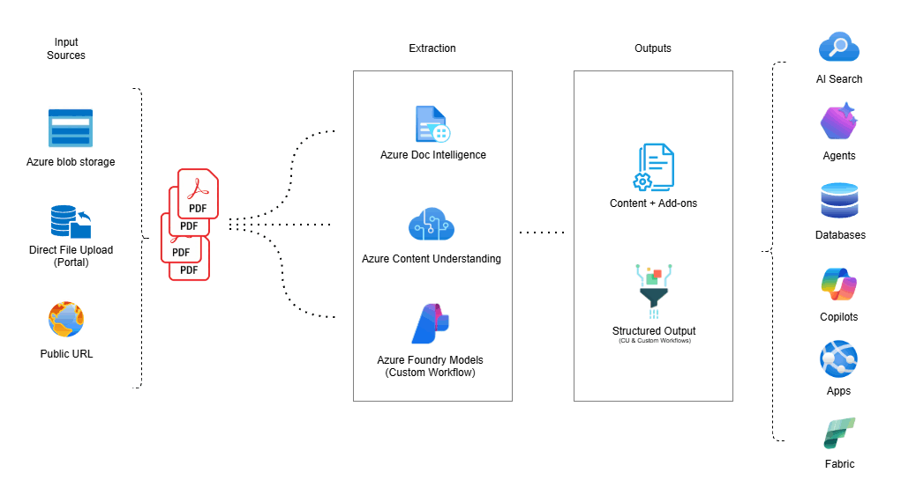
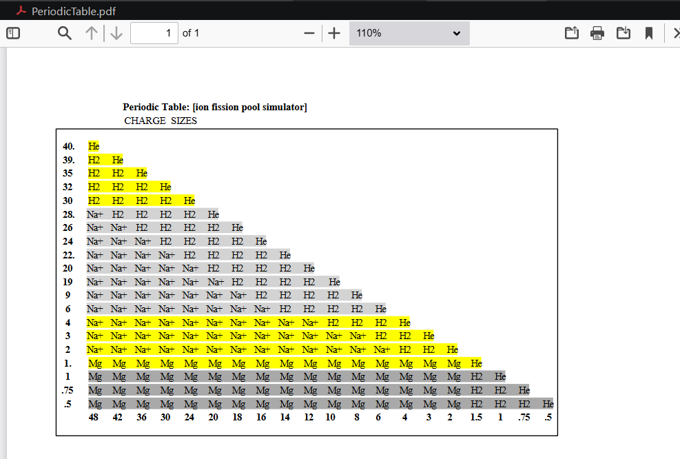
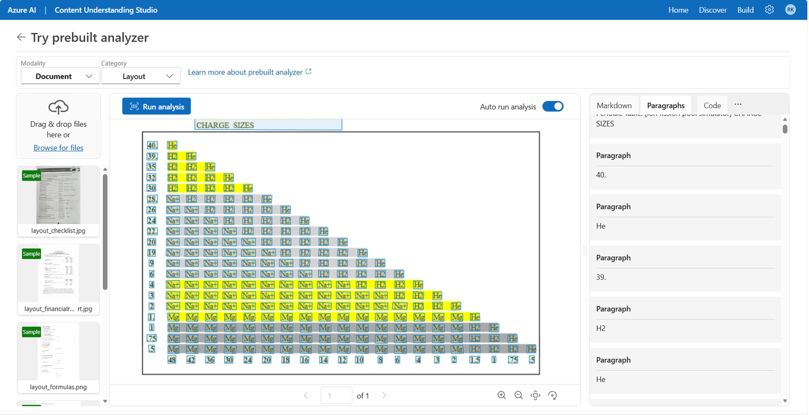

# Choose the Right Azure Foundry Tool for Document Processing

> *"As organizations increasingly use Generative AI to manage documents and unstructured data, it's essential to select the right tool for building robust, secure, and scalable document processing workflows. This is a comparative overview of the leading Azure AI solutions for intelligent document processing (IDP) to help you evaluate and choose the most effective approach for your business requirements."*

A hands-on notebook that runs the **same document** through all three Azure AI document processing approaches so you can see the fundamental difference between *seeing text*, *structuring content*, and *understanding meaning*.

---

## Architecture



> **About the architecture:** The three services at the centre: Azure Doc Intelligence, Azure Content Understanding, and Azure Foundry Models are what this notebook covers hands-on. The **input sources** shown (Azure Blob Storage, Direct File Upload, Public URL) reflect the range of ingestion patterns available in production deployments; this notebook uses a local PDF to keep the focus on the services themselves. The **downstream systems** shown (AI Search, Agents, Databases, Copilots, Apps, Fabric) are representative of where these structured outputs ultimately flow in real-world solutions and are included to illustrate business context, not as setup requirements for this notebook.

The notebook pipelines a single PDF through all three extraction services, each acting as a different lens on the same content. It shows you exactly what each one sees, how it sees it, and when to use it.

---

## The Three Lenses

| Service | Core Capability | Best For |
|---|---|---|
| **Azure AI Document Intelligence** | Extracts text, key-value pairs, tables, and layout structure with high accuracy and built-in confidence scoring | Standard forms, invoices, receipts, IDs, contracts; any document with a predictable structure |
| **Azure AI Content Understanding** | Goes beyond extraction to infer, reason, and process multimodal content (documents, images, audio, video) in a unified pipeline | Complex layouts, high template variation, derived fields, semantic understanding, zero-shot adaptation |
| **Azure AI Foundry (Custom Models)** | Full control — you choose the model, write the prompt, define the output format | Agentic workflows, narrative generation, rapid experimentation, scenarios requiring fine-grained model control |

---

## The Document: Why This PDF Is a Good Stress Test



The test document used throughout this notebook is `PeriodicTable.pdf` : An element table rendered as a visual grid. It's deliberately chosen because it breaks all the assumptions that make document AI "easy":

- No explicit row or column headers (numbers serve as implicit labels)
- Non-uniform row and column lengths throughout
- No gridlines or borders (cell boundaries are implied by spacing alone)
- Visual spacing used as the sole structural delimiter
- Inconsistent highlight colors across rows, adding visual noise

Running the three tools against this document exposes the real differences in how each service approaches document understanding, not just on clean, well-structured forms.

---

## Sneak Peek: What Content Understanding Sees



Azure AI Content Understanding doesn't just extract text, it reasons about the document's structure. In the portal, you can see it identifying paragraph roles, bounding regions, and semantic structure that goes well beyond raw OCR.

The full code, API calls, polling logic, and parsed output are all inside the notebook. Run it yourself to see the complete results for all three tools side by side.

---

## Prerequisites

### Azure Resources

- **Azure AI Document Intelligence** resource
  - FormRecognizer (Document Intelligence) resource
  - Custom subdomain enabled (required for CLI token authentication)
  - Location: eastus (or your preferred region)
- **Azure AI Content Understanding** resource (Azure AI Services / Foundry resource)
- **Azure CLI** installed and authenticated (`az login`)
- **Optional:** Azure AI Foundry project with a deployed model (for Tool 3)

### Python Packages

```bash
pip install azure-ai-documentintelligence azure-core azure-ai-inference pandas requests Pillow
```

### Local Files

- `PeriodicTable.pdf` in the same directory as the notebook

---

## Quick Start

### 1. Create Azure Resources

```bash
az login

az group create --name <your-resource-group-name> --location eastus

az cognitiveservices account create \
  --name <your-document-intelligence-resource-name> \
  --resource-group <your-resource-group-name> \
  --kind FormRecognizer --sku S0 --location eastus \
  --custom-domain <your-document-intelligence-resource-name> --yes

# Get access token (valid for ~1 hour)
az account get-access-token --resource https://cognitiveservices.azure.com --query accessToken -o tsv
```

### 2. Configure the Notebook

Update **Cell 3** with your resource details:

```python
RESOURCE_GROUP = "<your-resource-group-name>"
DI_RESOURCE    = "<your-document-intelligence-resource-name>"
DI_ENDPOINT    = "https://<your-document-intelligence-resource-name>.cognitiveservices.azure.com/"
CU_RESOURCE    = "<your-content-understanding-resource-name>"
CU_ENDPOINT    = "https://<your-content-understanding-resource-name>.cognitiveservices.azure.com/"
ACCESS_TOKEN   = "<paste-your-azure-cli-access-token-here>"
```


---

## Notebook Structure

| Cell | Purpose |
|---|---|
| 1 | Introduction, the three lenses, and architecture |
| 2 | Install Python dependencies |
| 3 | Configure Azure resources and authentication |
| 4 | Initialize Document Intelligence client |
| 5 | Verify document exists |
| 7 | Document Intelligence — OCR / Read |
| 8 | Document Intelligence — Layout (tables as DataFrames) |
| 11 | Azure AI Content Understanding — REST API |
| 13 | Azure AI Foundry — Custom model example (optional) |
| Last | Decision guide and scenario map |

---

## Authentication

This notebook uses **Azure CLI token authentication** — no API keys stored anywhere:

```bash
# Refresh token when it expires (~1 hour)
az account get-access-token --resource https://cognitiveservices.azure.com --query accessToken -o tsv
```

Paste the output into `ACCESS_TOKEN` in Cell 3 and re-run Cell 4.

---

## Troubleshooting

**Token expired** — Re-run the `az account get-access-token` command above and update Cell 3.

**Document not found** — Ensure `PeriodicTable.pdf` is in the same directory as the notebook.

**Custom subdomain required** — CLI token authentication requires a custom subdomain. Create your Document Intelligence resource with the `--custom-domain` flag as shown above.

---

## References

- [Choose the Right Azure Foundry Tool — Microsoft Docs](https://learn.microsoft.com/en-us/azure/ai-services/content-understanding/choosing-right-ai-tool)
- [Azure AI Document Intelligence](https://learn.microsoft.com/en-us/azure/ai-services/document-intelligence/)
- [Azure AI Content Understanding](https://learn.microsoft.com/en-us/azure/ai-services/content-understanding/)
- [Azure AI Foundry](https://learn.microsoft.com/en-us/azure/foundry/)

---

## Extraction Is Not the Destination — It's the Foundation

The outputs from these tools are not end results. They are structured, grounded, and semantically enriched representations of your documents, ready to power the next layer of intelligent systems:

**Agentic AI workflows** — Feed extracted and inferred fields directly into multi-step AI agents that reason, decide, and act. Document Intelligence's confidence scores and bounding boxes let agents know *where* information came from and *how reliable* it is, enabling routing, escalation, and human-in-the-loop patterns.

**RAG pipelines** — Clean, layout-aware text from Document Intelligence and semantically chunked markdown from Content Understanding make far better retrieval units than raw PDF text. Structure-aware chunking respects section boundaries, tables stay intact, and figures get described — meaning your retrieval model finds the right context, not just the right words.

**RPA and process automation** — Extracted key-value pairs, table rows, and inferred fields slot directly into RPA workflows, eliminating manual data entry from invoices, purchase orders, contracts, and forms at scale.

**Knowledge graph enrichment** — Entities, relationships, and inferred metadata extracted from documents become nodes and edges in enterprise knowledge graphs — connecting people, places, dates, and events across thousands of documents automatically.

**Compliance and audit pipelines** — Grounded extractions with bounding boxes create verifiable audit trails. Every extracted field links back to its exact location in the source document, making compliance review defensible and automatable.

**Data lakehouse ingestion** — Structured JSON and markdown outputs from these tools are first-class citizens in modern data platforms. Documents that were previously dark data become queryable, joinable, and analyzable alongside structured enterprise data.

The goal is not to extract text. The goal is to **unlock the intelligence trapped in your documents** and put it to work.

